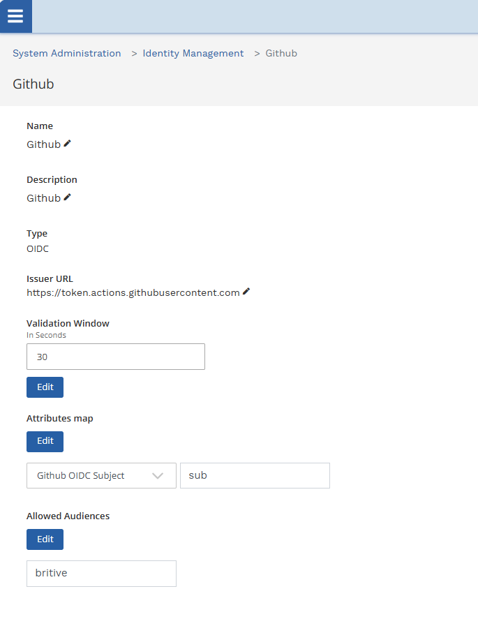
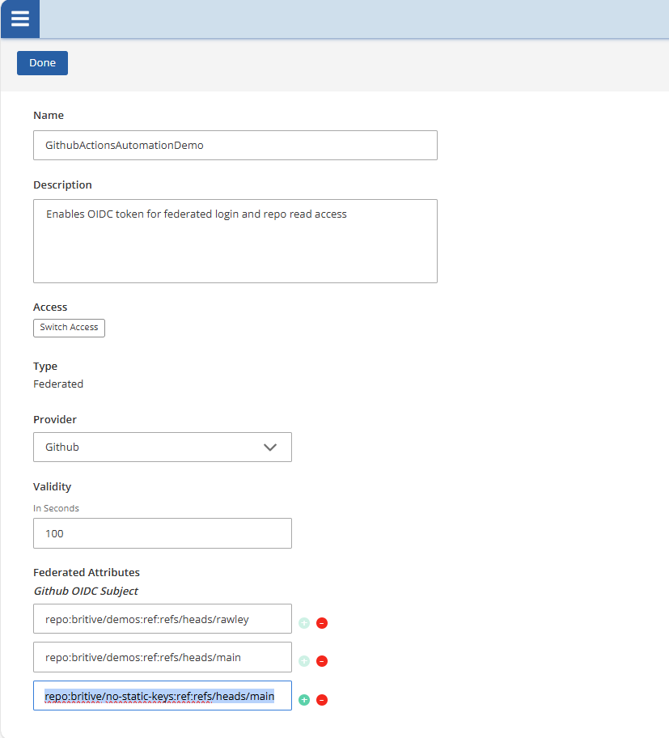
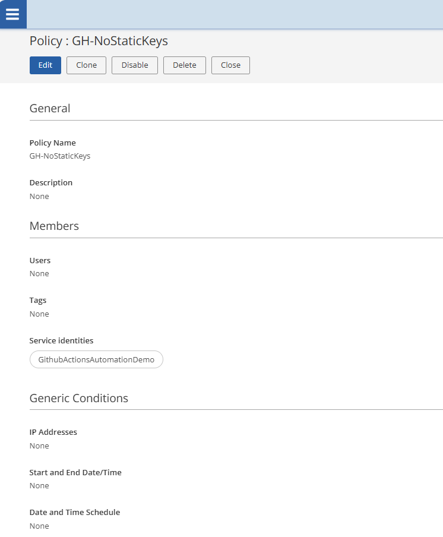
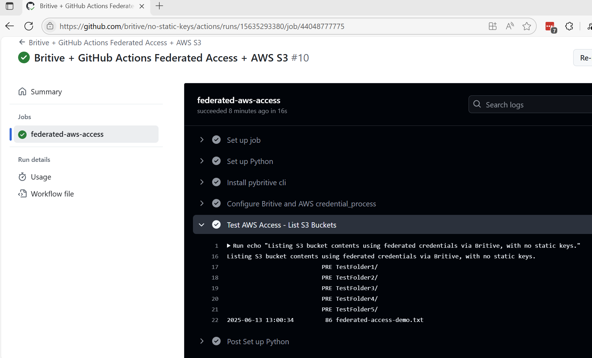

#  Britive + GitHub Actions: JIT Keyless Access to AWS S3

This repository demonstrates how [Britive](https://www.britive.com) provides just-in-time (JIT), ephemeral, and keyless access to AWS resources like S3 using OIDC federated identities.

No long-lived AWS credentials are stored. Instead, short-lived access is granted on demand through tightly scoped Britive policies.

---

##  Purpose

To show how **Britive enables GitHub Actions** to:
- Request federated AWS access
- Receive temporary credentials
- Perform scoped actions, like listing a specific S3 bucket
- Avoid the need for static access keys

This is powered by Britive’s Next-Gen Human Identity (NHI) framework and aligns with zero trust and least privilege access principles.

---

##  How It Works

### 1. Establish OIDC Trust

A trust is set up between Britive and your SaaS or cloud platform (GitHub, AWS, Azure, etc.)

- For GitHub: trust is based on repository name and branch
- For AWS: trust is based on the IAM Role ARN
- For Azure: Based on the Azure AD Object ID or App Registration ID of the requesting identity
- For GCP: Based on the Workload Identity Pool or Service Account email making the request

---

### 2. Define Federated Service Identity in Britive

Britive defines a federated service account to map the incoming GitHub or AWS identity.  
This is linked to a Britive profile, which represents access intent.

---

### 3. Attach a Britive Policy

The AWS policy defines what actions the federated identity can perform, the AWS role allows us to assume it and `s3:ListBucket` for a specific bucket.

---

### 4. GitHub Action Triggers Access

A GitHub Action uses the `pybritive` CLI to authenticate with Britive, using OIDC federated identity with no static keys.  
Britive validates the identity, applies the policy, and issues short-lived AWS credentials.

---

### 5. Temporary Credentials Used to List S3 Bucket

The AWS CLI uses `credential_process` to inject the temporary credentials.  
This enables a GitHub Action to access AWS without any static keys.

Here’s what’s happening:

- The AWS CLI sees credential_process and runs the command (pybritive ...)
- The pybritive CLI returns temporary credentials in JSON (format expected by AWS)
- AWS CLI uses those creds to make the actual API calls

---

##  Benefits of This Approach

-  **No static AWS keys** in your CI/CD workflows
-  **Short-lived credentials** reduce risk exposure
-  **Policy-driven access** scoped by purpose and role
-  **Reusable** for any identity provider (GitHub, Azure DevOps, etc.)
-  **Auditable & centrally managed** via Britive

---

##  What This Repo Demonstrates

- Setting up GitHub OIDC trust with Britive
- Creating a Britive service identity mapped to a GitHub repo
- Associating the identity with a Britive policy that allows read access to a specific AWS S3 bucket
- Listing the bucket contents in a GitHub Action with no static credentials

Visit here to see the GitHub Action
[https://github.com/britive/no-static-keys/actions](https://github.com/britive/no-static-keys/actions)

Review the YAML here
[https://github.com/britive/no-static-keys/blob/main/.github/workflows/keyless-aws-access.yml](https://github.com/britive/no-static-keys/blob/main/.github/workflows/keyless-aws-access.yml)

---
